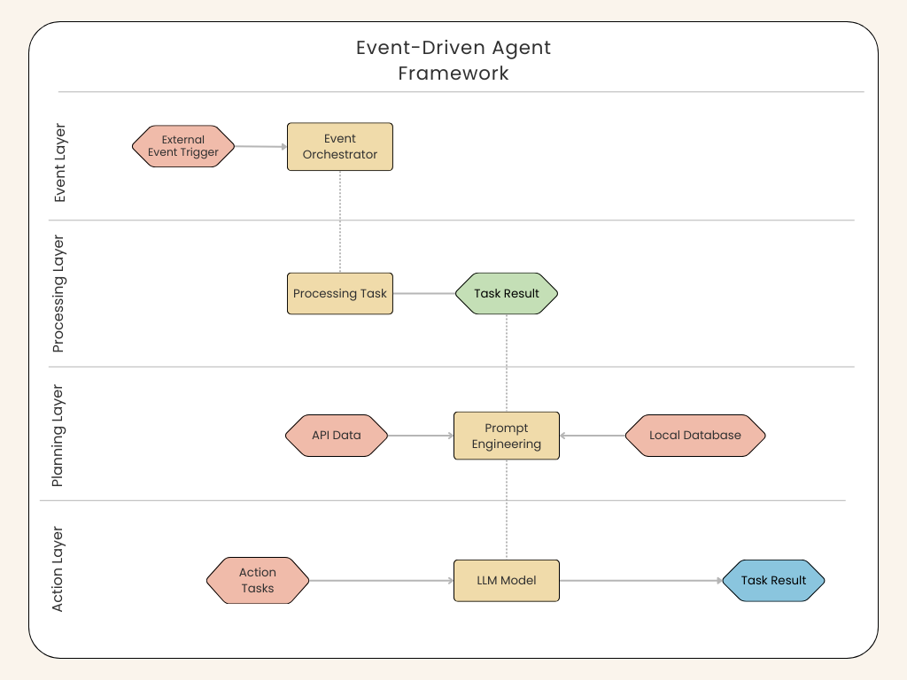

# Event-Driven Agent Framework

The **Event-Driven Agent Framework** is a Python framework designed to build intelligent agents that process events 
from sensors, wearable devices, or any external system.  
It combines **ProcessingTasks**, which transform raw events into structured insights, and **ActionTasks**, 
which allow the agent to trigger external actions (e.g., turning on alarms, sending notifications, or interacting with third-party APIs).

---

## 🔑 Key Concepts

- **Event**  
  The basic unit of information the agent receives.  
  Example: a movement detection event, a low battery event, or a health metric reading.

- **ProcessingTask**  
  A task that analyzes incoming events and produces insights or predictions.  
  Example: detect if a person appears in a camera feed.

- **ActionTask**  
  A callable action that the LLM can execute to respond to an event.  
  Example: trigger an alarm or send a push notification.

- **Planner**  
  Orchestrates how events are processed and decides which actions (if any) should be executed. The planner leverages an LLM to interpret context and select appropriate actions.

- **TaskRegistry**  
  A central registry for all `ProcessingTasks` and `ActionTasks`. The framework may be extended by registering new tasks.

---

## ⚙️ Architecture Overview



1. The **Event Orchestrator** receives an external event and delegates it to the appropriate Processing Task.
2. **The ProcessingTask** executes business logic and produces structured results (Processing Task Result).
3. **The Planner interprets** the Task result using an LLM and selects one or more Action Tasks to be executed.
4. The chosen Action Tasks are executed, producing side effects (e.g., notifications, alarms).

---

## 🚀 Example Flow

A movement is detected by the security system, triggering an action called `MovementDetectionTask`.
The `MovementDetectionTask` will be executed, returning a structured result:
```json
{"object_detected": "person"}
```
The Planner interprets this and decides to execute an Action Task called `turn_alarm_on`:
```json
{
  "function_call": {
    "name": "turn_alarm_on",
    "args": { "alarm_type": "Noise" }
  }
}
```

## 📚 Guide

- [Installation Guide](install.md)
- [Famework Modules](modules.md)
- [Use Case example](usecase.md)
- [Creating Action Tasks](actions.md)
- [Creating Processing Tasks](processing.md)  
